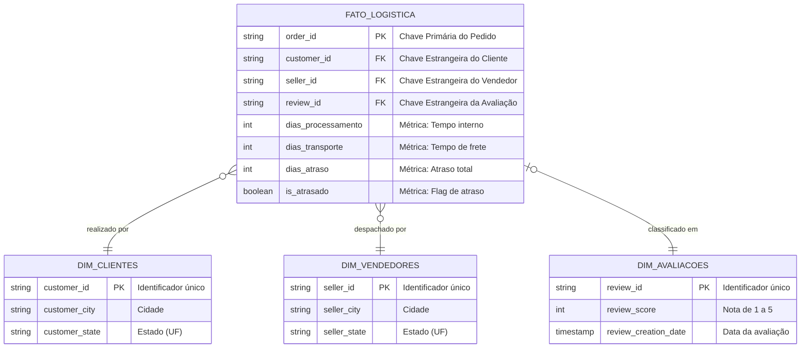

# MVP de Engenharia de Dados: Otimização Logística e Satisfação do Cliente no E-commerce

Este repositório contém o Produto Mínimo Viável (MVP) desenvolvido para a disciplina de Engenharia de Dados. O projeto implementa um pipeline ETL completo na nuvem (Databricks), desde a ingestão de dados brutos até à modelagem analítica.

---

## 1. Contexto de Negócios e Perguntas (Etapas 2 e 4.1)

No ambiente altamente competitivo do comércio eletrónico, a pontualidade na entrega é um dos pilares centrais da retenção de clientes. O problema central que este projeto visa resolver é: **Identificar os principais estrangulamentos na cadeia de distribuição que causam atrasos nas entregas e compreender como essas falhas logísticas impactam diretamente a métrica de satisfação do cliente.**

Para guiar o pipeline, definimos as seguintes perguntas de negócio:
1. **Visão Geográfica:** Qual é a taxa média de atraso agrupada por Estado (UF) de origem e destino?
2. **Localização do Gargalo:** Onde ocorre a maior perda de tempo logístico: no processamento interno ou no trânsito da transportadora?
3. **Impacto na Satisfação:** Qual é a correlação direta entre o volume de dias de atraso e a nota de avaliação do pedido?
4. **Performance de Parceiros:** Existem vendedores específicos que falham sistematicamente no prazo de expedição?

**Dados Brutos e Licença:**
Utilizamos o **Brazilian E-Commerce Public Dataset by Olist**. A base é relacional e inclui tabelas de pedidos (`orders`), itens (`order_items`), avaliações (`order_reviews`), clientes (`customers`) e vendedores (`sellers`). Os dados estão anonimizados e licenciados sob a **CC BY-NC-SA 4.0** (Creative Commons), permitindo o uso aberto para fins académicos e de portfólio.

---

## 2. Carga dos Dados (Etapa 4.2)

A extração dos dados foi automatizada através de um script em Python utilizando a biblioteca `kagglehub`. Os ficheiros CSV foram descarregados diretamente para o ambiente da nuvem e armazenados num **Volume do Unity Catalog** no Databricks, simulando um Data Lake. 

* **Script de referência:** [`03 - download.ipynb`](https://github.com/amandammt17/puc-rioMVP_Engenharia-de-Dados/blob/main/Notebooks/03%20-%20download.ipynb)

---

## 3. Modelagem e Catálogo de Dados (Etapa 4.3)

Para estruturar os dados de forma otimizada para consultas analíticas (OLAP), adotamos o **Modelo Estrela (Star Schema)**. Esta arquitetura dimensional é composta por uma tabela central de fatos rodeada por tabelas de dimensões descritivas, o que reduz a redundância, simplifica as junções (*JOINs*) e acelera a performance das consultas nas ferramentas de BI.

A nossa modelagem foi definida da seguinte forma:
* **Tabela Fato (`fato_logistica`):** É o coração do modelo. Regista o evento transacional (o pedido/entrega) e armazena as métricas quantitativas (dias de processamento, dias de transporte, dias de atraso) e as chaves estrangeiras (FK).
* **Tabelas Dimensão (`dim_clientes`, `dim_vendedores`, `dim_avaliacoes`):** Armazenam os atributos descritivos que dão contexto à tabela facto, como a localização geográfica de quem comprou e de quem vendeu, e o texto/nota da avaliação final.

Abaixo encontra-se a representação visual (Diagrama de Entidade-Relacionamento) da nossa modelagem em Estrela:

O **Catálogo de Dados** foi integralmente documentado no Unity Catalog do Databricks, detalhando descrições, tipos de dados e os **domínios de valores** de cada coluna (ex: limites numéricos e categorias aceites).

* **Script de referência:** [`04 - bronze.ipynb`](https://github.com/amandammt17/puc-rioMVP_Engenharia-de-Dados/blob/main/Notebooks/04%20-%20bronze.ipynb)

---

## 4. Pipeline de Dados (Etapa 4.4)

O processo ETL foi segmentado em múltiplos *notebooks* (PySpark/SQL) para garantir organização, reprodutibilidade e modularidade. 

Uma decisão arquitetural importante deste projeto foi a de **persistir todos os arquivos originais baixados do Kaggle na camada Bronze**, garantindo um histórico completo, inalterado e pronto para responder a perguntas futuras de outras áreas da empresa. No entanto, para otimizar o processamento e manter o foco no objetivo do MVP, **apenas as tabelas estritamente necessárias para as análises logísticas avançaram para a camada Silver** (filtrando tabelas não utilizadas como geolocalização, traduções, produtos e pagamentos).

Abaixo está o fluxo detalhado da pipeline:

1. **`02 - preparação.ipynb`**: Configuração inicial do Unity Catalog, criando o catálogo e os esquemas (`staging`, `bronze`, `silver`, `gold`).
2. **`03 - download.ipynb`**: Extração (Extract) automática da base completa via API do Kaggle para um Volume do Databricks (`staging`).
3. **`04 - bronze.ipynb`**: Carga (Load) inicial de **todos** os ficheiros CSV transformados no formato otimizado Delta na camada Bronze, acompanhados da documentação de metadados e domínios.
4. **`05 - silver.ipynb`**: Filtro arquitetural (apenas as tabelas `orders`, `order_items`, `order_reviews`, `customers` e `sellers` avançam). Aplicação de transformações (Transform), tipagem de datas e auditoria de qualidade.
5. **`06 - gold.ipynb`**: Desnormalização final e criação do modelo analítico em Estrela (`fato_logistica`).

*(Captura de tela comprovando as tabelas guardadas no Databricks)*

---

## 5. Qualidade de Dados (Etapa 4.5)

Antes das transformações na camada Silver, conduzimos uma auditoria de qualidade rigorosa focada em Completude, Unicidade, Consistência e Acurácia:
* **Completude (Nulos):** Detectamos nulos na coluna `order_delivered_customer_date`. A análise revelou que pertenciam a pedidos cancelados. **Solução:** Filtramos o dataset para manter apenas pedidos com status `delivered`.
  
  
  
*(Captura de tela comprovando a detecção de nulos)*
* **Unicidade:** Validamos que a chave `order_id` não possuía duplicatas na tabela de pedidos. Na tabela de itens e avaliações, aplicamos `dropDuplicates(["order_id"])` para não inflacionar os cálculos.
  
  
  
*(Captura de tela comprovando a unicidade)*
* **Acurácia (Outliers):** Encontramos valores de frete iguais a `$0.0`. Estes não foram descartados, pois representam promoções legítimas de "Frete Grátis".
  
  
  
  *(Captura de tela comprovando a detecção de outliers)*

* **Script de referência:** [`05 - silver.ipynb`](https://github.com/amandammt17/puc-rioMVP_Engenharia-de-Dados/blob/main/Notebooks/05%20-%20silver.ipynb)

---

## 6. Análise de Dados (Etapa 4.5)

Com os dados modelados na tabela `fato_logistica` (Camada Gold), respondemos às perguntas de negócio utilizando Spark SQL:

**1. Visão Geográfica (Rotas Críticas):**
Identificámos que as rotas com origem no Sudeste e destino nas regiões Norte/Nordeste lideram os dias de atraso absoluto.

**2. Localização do Gargalo:**
A análise provou que a maior parcela do tempo logístico (e dos atrasos) ocorre na etapa de transporte rodoviário, e não no processamento interno dos parceiros.

**3. Impacto na Satisfação:**
Confirmamos a correlação direta: pedidos com atrasos longos concentram quase a totalidade das avaliações de 1 e 2 estrelas.

**4. Performance de Parceiros:**
Listamos um ranking de vendedores (Sellers) que falham sistematicamente (tempo médio de processamento interno superior a 10 dias).

* **Script de referência:** [`07 - analises.ipynb`](https://github.com/amandammt17/puc-rioMVP_Engenharia-de-Dados/blob/main/Notebooks/07%20-%20analise.ipynb)

---

## 7. Autoavaliação

**Objetivos Atingidos:**
O pipeline foi construído com sucesso e respondeu a todas as perguntas originais do MVP, provando a robustez da Arquitetura Medalhão.

**Dificuldades Encontradas:**
O maior desafio técnico foi a curva de aprendizagem na gestão de permissões e configuração do Unity Catalog no Databricks, bem como lidar com as particularidades da modelagem temporal (calcular as diferenças de datas corretas lidando com fusos horários e valores nulos).

**Trabalhos Futuros:**
Para a evolução deste portfólio, pretendo:
1. Ligar a camada Gold a uma ferramenta de Data Visualization (como o Power BI ou Tableau) para criar mapas interativos de calor dos atrasos.
2. Adicionar uma etapa de *streaming* simulada para analisar a alteração de status dos pedidos em tempo real.
3. Incorporar dados meteorológicos externos via API para cruzar dias de fortes chuvas com os picos de atraso no transporte.
